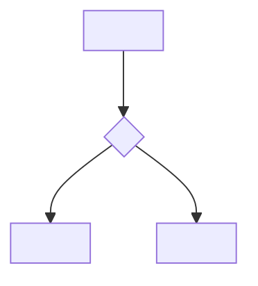

# Navegação — <produto>

## Rotas

| Rota | Tela | Acesso | Feature |
|------|------|--------|---------|
| <'/'> | <Home> | <público \| autenticado \| admin> | [<feature>](features/<feature>.md) |

Regras de acesso por perfil: [regras.md](regras.md).

## Fluxos

<!-- Dono: fw-ux (U3). Um diagrama por jornada. Nenhuma tela nasce antes daqui. -->

### <Jornada>

## Estados de navegação

| Situação | Comportamento |
|----------|---------------|
| Rota inexistente | <404 — tela X> |
| Sem permissão | <redirect para Y, sem vazar existência> |
| Sessão expirada | <redirect para login preservando destino> |
